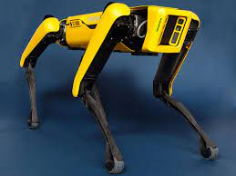

Image | Link
--- | ---
 | [aruco-code-detection](aruco-code-detection)
 | [audio_say](audio_say)
 | [autopilot bridge](autopilot bridge)
 | [caffe-object-detection](caffe-object-detection)
 | [cartographer-slam](cartographer-slam)
 | [cogniteam-anomaly-detection](cogniteam-anomaly-detection)
 | [cogniteam-merge-videos](cogniteam-merge-videos)
 | [cogniteam-random-goals](cogniteam-random-goals)
 | [custom-message-talker-listener](custom-message-talker-listener)
 | [custom-message-talker-listener](custom-message-talker-listener)
 | [custom-ros-service](custom-ros-service)
 | [custom-ros-service](custom-ros-service)
 | [deegoo-fpv-gps](deegoo-fpv-gps)
 | [faces-landsmarks-mediapipe](faces-landsmarks-mediapipe)
 | [generic-webcam-with-mic](generic-webcam-with-mic)
 | [hamster-wandering](hamster-wandering)
 | [hands_pose_detection](hands_pose_detection)
 | [image-topic-to-rtsp](image-topic-to-rtsp)
 | [imu-filter-madgwick](imu-filter-madgwick)
 | [joystick-teleop-twist](joystick-teleop-twist)
 | [nextVision_cam](nextVision_cam)
 | [path-publisher](path-publisher)
 | [path-waypoints-navigation](path-waypoints-navigation)
 | [ros-serial-st-python](ros-serial-st-python)
 | [ros-tutorials-listener](ros-tutorials-listener)
 | [ros-tutorials-talker](ros-tutorials-talker)
 | [ros1-gateway-arm32](ros1-gateway-arm32)
 | [ros1-gateway-launch](ros1-gateway-launch)
None | [ros1-leg-detector](ros1-leg-detector)
 | [sick-safety-nanoscan3](sick-safety-nanoscan3)
 | [slamtec-rplidar-driver](slamtec-rplidar-driver)
 | [slamtec-rplidar-driver](slamtec-rplidar-driver)
 | [slamtec-rplidar-driver](slamtec-rplidar-driver)
 | [slamtec-rplidar-driver](slamtec-rplidar-driver)
 | [slamtec-rplidar-driver](slamtec-rplidar-driver)
 | [spot-bridge](spot-bridge)
 | [stm-remote-burn](stm-remote-burn)
 | [tflite-object-detection](tflite-object-detection)
 | [turtlebot3](turtlebot3)
 | [turtlebot3](turtlebot3)
 | [turtlebot3](turtlebot3)
 | [turtlebot3](turtlebot3)
 | [turtlebot3](turtlebot3)
 | [vosk-speech-to-text](vosk-speech-to-text)
